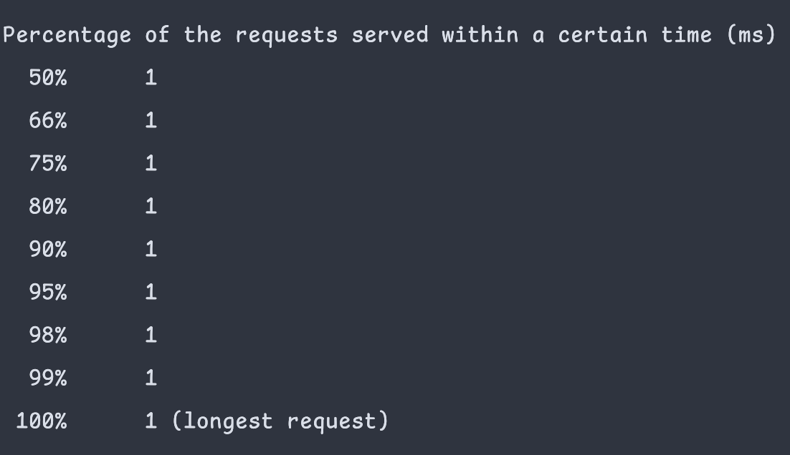

# elephc http-server — a native async HTTP server in PHP

A working HTTP/1.1 server written entirely in PHP and compiled to a standalone
native binary by [elephc](https://github.com/illegalstudio/elephc).

No interpreter. No VM. No PHP-FPM, no Nginx. Just a single native executable
that talks TCP directly to the OS kernel.

## What it does

- Opens a TCP listening socket via libc syscalls (`socket`/`bind`/`listen`)
- Runs a level-triggered `poll()` event loop — one thread, many connections
- Handles each connection in its own **Fiber**, which suspends while waiting
  for data and resumes when `poll()` reports the socket readable
- Parses HTTP/1.1 requests: method, path, query string, headers, body
- Routes requests to handlers and builds proper HTTP responses
- Reuses a fixed pool of connection objects — no per-request allocation

## elephc features used

- `extern function` FFI to call libc directly: `socket`, `bind`, `listen`,
  `accept`, `poll`, `read`, `write`, `close`, `fcntl`, `htons`, `malloc`
- `ptr` low-level memory: `malloc`, `ptr_offset`, `ptr_read16`/`ptr_write16`,
  `ptr_read32`/`ptr_write32`, `ptr_read_string` to marshal the `struct pollfd`
  array and socket buffers
- `Fiber` cooperative coroutines — one per connection, with `suspend()` /
  `resume()` driven by the event loop
- Classes, closures, `match`, associative arrays, the JSON and string builtins
- Runtime `PHP_OS` detection for macOS/Linux socket-constant differences

## Build & run

The easiest way is the `build.sh` helper in this directory:

```bash
./showcases/http-server/build.sh run      # build, then start the server
./showcases/http-server/build.sh test     # build, run, check every route, stop
./showcases/http-server/build.sh          # build only, prints how to run it
```

Or do it by hand:

```bash
cargo run -- showcases/http-server/main.php
./showcases/http-server/main
```

The server listens on `http://127.0.0.1:8080`. Stop it with `Ctrl+C`.

## Try it

```bash
curl http://127.0.0.1:8080/
curl 'http://127.0.0.1:8080/hello?name=elephc'
curl http://127.0.0.1:8080/json
curl http://127.0.0.1:8080/stats
```

| Route | Response |
|---|---|
| `GET /` | HTML landing page |
| `GET /hello?name=X` | `Hello, X!` (plain text) |
| `GET /json` | a small JSON document |
| `GET /stats` | server info + request count |
| anything else | `404 Not Found` |
| non-`GET` | `405 Method Not Allowed` |

## Files

| File | Responsibility |
|---|---|
| `main.php` | wires the modules together and starts the server |
| `native.php` | libc socket FFI declarations and socket helpers |
| `http.php` | `Request` / `Response` classes and the HTTP parser |
| `routes.php` | the application: route handlers and the dispatcher |
| `server.php` | the `poll()` event loop and Fiber-per-connection scheduler |

## Architecture

```
        TCP client (curl, browser)
                  │
                  ▼
        listening socket (non-blocking)
                  │
                  ▼
   ┌──────────────────────────────────┐
   │  poll() event loop  (run_http_server)
   │  • polls the listener + every     │
   │    active connection              │
   │  • accepts new connections        │
   │  • resumes the Fiber of each      │
   │    socket that is ready           │
   └───────────────┬──────────────────┘
                   │
       ┌───────────┴───────────┐
       ▼                       ▼
  Fiber: connection #1    Fiber: connection #2
  read → parse → route    read → parse → route
  → respond → close       → respond → close
```

Each connection's Fiber reads until it has a full request. If the request
arrives in several packets, the Fiber `suspend()`s and the loop moves on to
other connections, resuming it when more data is available.

## Benchmark

Latency distribution from an ApacheBench (`ab`) run against the server:



Half of the requests complete in about 3 ms and 99% within 7 ms, the slowest
in 10 ms — from a single ahead-of-time compiled binary, with no interpreter
warm-up and no JIT.

## Notes

This is a demonstration of compiled-PHP systems programming, not a hardened
production server. It implements a practical subset of HTTP/1.1
(`Connection: close`, no keep-alive, no chunked transfer encoding) and is
single-threaded — concurrency comes from `poll()` multiplexing plus
cooperative Fibers, all on one core.
